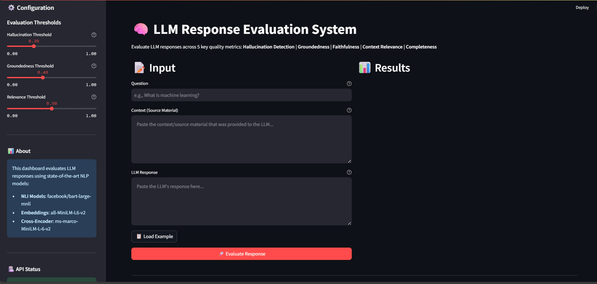
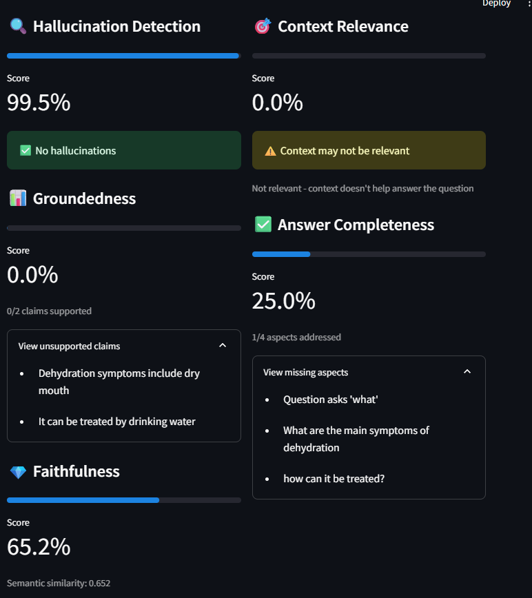

# 🧠 LLM Response Evaluation Framework

[](https://www.python.org/downloads/)
[](https://fastapi.tiangolo.com/)
[](https://streamlit.io/)
[](https://opensource.org/licenses/MIT)
[](https://github.com/psf/black)

A production-ready system for evaluating LLM responses across 5 key metrics: hallucination detection, groundedness, faithfulness, context relevance, and answer completeness.

## � Screenshots

### Dashboard Home Page


### Example 1: High-Quality Response (Good Results)


### Example 2: Poor Response with Issues



## �📊 Evaluation Metrics

1. **Hallucination Detection** - Detects contradictions and fabricated information using NLI models
2. **Groundedness Score** - Measures % of claims supported by source context
3. **Faithfulness Score** - Calculates semantic similarity between response and context
4. **Context Relevance** - Scores how relevant the provided context is to the question
5. **Answer Completeness** - Checks if the answer addresses all aspects of the question

## 🛠️ Tech Stack

- **Backend**: FastAPI
- **Frontend**: Streamlit
- **ML/NLP**: HuggingFace Transformers, SentenceTransformers, spaCy

## 🚀 Quick Start

### 1. Install Dependencies

```bash
pip install -r requirements.txt
python -m spacy download en_core_web_sm
```

### 2. Set Up Environment (Optional)

Create a `.env` file to customize settings:
```
MODEL_CACHE_DIR=./models
LOG_LEVEL=INFO
HALLUCINATION_THRESHOLD=0.5
GROUNDEDNESS_THRESHOLD=0.7
FAITHFULNESS_THRESHOLD=0.6
RELEVANCE_THRESHOLD=0.5
COMPLETENESS_THRESHOLD=0.7
```

### 3. Run the API

```bash
python -m uvicorn app.main:app --reload
```

API will be available at: http://localhost:8000
API docs at: http://localhost:8000/docs

### 4. Run the Dashboard

```bash
streamlit run dashboard/app.py
```

Dashboard will open at: http://localhost:8501

## 📁 Project Structure

```
LLM_eval/
├── app/
│   ├── main.py              # FastAPI application
│   ├── models.py            # Pydantic data models
│   └── __init__.py
├── evaluators/
│   ├── __init__.py
│   ├── hallucination.py     # Hallucination detector
│   ├── groundedness.py      # Groundedness scorer
│   ├── faithfulness.py      # Faithfulness scorer
│   ├── relevance.py         # Context relevance checker
│   ├── completeness.py      # Answer completeness checker
│   └── pipeline.py          # Main evaluation pipeline
├── dashboard/
│   └── app.py               # Streamlit dashboard
├── screenshots/             # Dashboard screenshots
├── examples.py              # Usage examples
├── requirements.txt         # Python dependencies
├── .env                     # Environment configuration
├── .gitignore
└── README.md
```

## 📚 How It Works

### Hallucination Detection (NLI)
Uses Natural Language Inference models to detect contradictions:
- **Premise**: Source context
- **Hypothesis**: LLM response claim
- **Output**: Entailment/Neutral/Contradiction

### Groundedness Scoring
1. Extracts atomic claims from the response
2. Checks each claim against source context
3. Calculates % of grounded claims

### Faithfulness Scoring
1. Generates embeddings for response and context
2. Calculates cosine similarity
3. Higher score = more faithful to source

### Context Relevance
Uses cross-encoder models to score how relevant the context is to answering the question.

### Answer Completeness
1. Identifies key aspects in the question
2. Checks if each aspect is addressed in the answer
3. Calculates completeness percentage

## 🔄 API Usage

```python
import requests

response = requests.post("http://localhost:8000/api/evaluate", json={
    "question": "What is the capital of France?",
    "context": "France is a country in Europe. Paris is its capital city.",
    "llm_response": "The capital of France is Paris."
})

print(response.json())
```

## 📈 Current Status & Future Enhancements

**✅ Implemented:**
- Core evaluation engine with 5 metrics
- FastAPI REST API with auto-generated docs
- Interactive Streamlit dashboard
- Comprehensive logging and error handling
- Example scripts for direct usage

**🚧 Future Enhancements:**
- Database integration for evaluation history
- Advanced caching for model predictions
- Batch evaluation endpoints
- Comparison reports across multiple responses
- SQL Server migration for production
- Docker containerization
- Performance optimization


## 📝 License

MIT License
